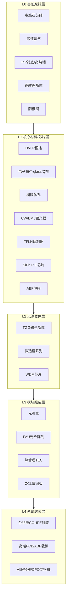

# AI 时代上游供应链知识整理

> 资料来源：行业研报/社媒整理（个人观点，仅供参考，不构成投资建议）  
> 整理日期：2026-06-20

---

## 一、宏观背景

### 1.1 核心判断

AI 基建需求爆发，带动上游物料股价普涨。行业技术壁垒极高，供应链可从「泥土」到「机房」分为 **L0 → L4** 层级，每一层都是下一层的瓶颈。

**涉及的关键物料：**

| 方向 | 关键物料 |
|------|----------|
| PCB | HVLP4 铜箔、电子布、Q 布、工业气体、树脂 |
| CPO | InP 衬底、激光器、TFLN 调制器、亚微米耦合 |
| 高纯材料 | 铌酸锂薄膜、高纯石英砂、高纯铟、高纯钨 |

### 1.2 ABF 载板：从 PCB 周期到 AI 瓶颈

- **大摩研报**（2026.5.20）：2030 年供需缺口从 15% 上调至 **22%**
- ABF 行业已脱离传统 PCB 周期，成为 **AI 时代关键瓶颈**
- 味之素（Ajinomoto）高度垄断 ABF 薄膜，长交期 + 长约机制形成「卡脖子」

---

## 二、紧缺度总览（快速查阅）

### 2.1 高端 PCB 交付瓶颈（紧缺度从高到低）

| 排名 | 物料 | 规格 | 核心原因 |
|:----:|------|------|----------|
| 1 | **高端电子布** | Low-Dk 1/2 代 + Low-CTE/T-glass（超薄/极薄） | 产能高度集中，窑炉/织造/后处理扩产周期长；AI 服务器 + 高阶 CCL 消耗最稀缺规格，引发全行业连锁紧缺。**当前紧缺的是电子布，未来方向是石英布（Q 布）** |
| 2 | **高端铜箔** | HVLP4 / RTF 等高速板认证级 | 普通铜箔可调，但顶级 CCL/终端认证的低粗糙度箔供不应求，满产满销 + 加工费上涨 |
| 3 | **高端树脂体系** | 低 Df 配方 + 稳定批次 | 「配方 + 认证」壁垒高，扩产≠立即可用；铜箔/电子布紧张时成为成本驱动因素 |
| 4 | **载板侧** | ABF 薄膜 / T-glass | 味之素高度垄断，长交期；主要影响 GPU/CPU 载板，非整个 PCB 市场 |
| 5 | **普通 FR4 材料** | 常规铜箔 / E 布 / 通用环氧 | 紧缺更多来自铜价 + 周期，非规格性长期断供 |

### 2.2 CPO 上游紧缺排名

| 排名 | 物料/组件 | 紧缺原因 | 国内代表 |
|:----:|-----------|----------|----------|
| 1 | **InP 衬底 + CW/EML 激光芯片** | 日本垄断；晶体炉/MOCVD 扩产周期长；认证锁定；产能 + 良率双瓶颈 | 衬底：云南锗业；光芯片：东山精密、源杰科技、光迅科技 |
| 2 | **TFLN 薄膜铌酸锂调制器** | 全球仅 3 家量产；光库收购 Lumentum 产线；住友仍控晶体端 | 器件：光库科技；晶体：天通股份、福晶科技 |
| 3 | **TGG 磁光晶体（光隔离器）** | 铽原料稀缺；单晶生长周期长；CPO 反射控制必需 | 福晶科技（国内唯一达全球水平） |
| 4 | **FAU/微透镜耦合精度** | 非材料短缺，而是工艺 + 产能短缺 | 天孚通信 |
| 5 | **台积电 COUPE 封装产能** | 封装非材料，但决定 CPO 落地规模上限 | 长电科技 |

### 2.3 12 项芯片稀缺工艺 & 材料（节选）

| 编号 | 物料 | 定位 | 供需态势 |
|:----:|------|------|----------|
| 1 | 电子级硫酸 | 芯片湿法清洗/刻蚀关键原料 | 年内涨价 50%+，短期难缓解 |
| 2 | MLCC 电容 | 电子工业「大米」 | 年涨 50%+，全球现货紧缺，明年加剧 |
| 9 | 铜箔 | 锂电负极 + PCB 覆铜板核心原料 | 年内价格翻倍，现货缺口大 |
| 10 | 电子布 | 覆铜板关键增强材料 | 高端规格年内翻倍，紧缺周期预计至 **2028** |
| 11 | 半导体铝靶材 | 芯片溅射镀膜必需 | 上游铝粉年涨 80%，短缺至 **2027 末** |
| 12 | 高纯氦气 | 刻蚀/晶圆清洗特种气体 | 气源海外集中，年涨 100%+ |

---

## 三、PCB 上游供应链全景（L0 → L3）

### 产业链流向

```
基础大宗（铜）→ 三大主材（铜箔/树脂/玻纤布）→ 覆铜板 CCL（FR4/高速/载板）
→ 配套化学品 & 填料 → IC 载板专属材料（ABF 薄膜/T-glass 等）
```

### L0：源头（成本锚，技术壁垒相对较低）

| 物料 | 作用 | 代表企业 |
|------|------|----------|
| 阴极铜 → 铜杆 | PCB 铜材成本基础 | 江西铜业、铜陵有色 |
| 磷铜球/铜阳极 | 电镀填孔 | 铜陵有色、云南铜业 |

> 非战略卡点，但铜价波动影响全链条成本。

### L1-①：电子铜箔（决定传导损耗，AI 板核心）

| 细分 | 重要性 | 代表企业 |
|------|--------|----------|
| RTF（反转处理箔） | 普通高速板主流 | 德福科技、铜冠铜箔、逸豪新材 |
| HVLP Gen 1-2 | 中高速板 | 铜冠铜箔、德福科技 |
| **HVLP Gen 3-4** | **AI 服务器/高频高速板核心瓶颈**，全球稳定供应者极少 | **铜冠铜箔**（HVLP 系列量产）、**德福科技**（HVLP3 规模化，HVLP4 跟进） |
| 载体铜箔（可剥离铜） | 载板/细线路方向 | 海外三井、景旺等；国内追赶中 |

> 普通铜箔不缺，紧缺在 HVLP3+ 及载体铜箔等高端认证级。

### L1-②：电子玻纤布/电子纱（当前最难瓶颈）

| 细分 | 重要性 | 代表企业 |
|------|--------|----------|
| 普通 E 布（如 7628） | FR4 基础，周期性产品 | 中国巨石、中材科技（泰山玻纤）、山东玻纤 |
| **Low-Dk 1/2 代布** | 高频高速 CCL 降 Dk/Df 关键 | **宏和科技**（1/2 代 Low-Dk 量产，国内仅两家之一）、**中材科技**（扩产追赶） |
| **T-glass / Low-CTE 布** | 高可靠性/载板级尺寸稳定性 | **宏和科技**（国内唯一能量产全系列 Low-CTE 布） |
| **石英布 / Q 布** | M8/M9 级板顶级方案，超低损耗 | **菲利华**（Q 布全球核心）、**中材科技**（第三代 Q 布） |

> **关键趋势**：当前炒作的是电子布，未来终将过渡到 Q 布。

### L1-③：树脂体系（Df/介电损耗之源）

| 细分 | 作用 | 代表企业 |
|------|------|----------|
| 电子级环氧（基材） | FR4 及普通高速板基体 | 宏昌电子 |
| PPO/PPE 树脂 | M6+ 低损耗板核心材料 | 圣泉集团 |
| 碳氢树脂 / BMI | 更高耐温、更稳定 CTE（RF/航天/部分高速） | 东材科技 |
| 活性酯固化剂/特种助剂 | 高端配方「调味料」 | 海外三菱瓦斯、旭化成；国内东材科技追赶 |

### L3：配套材料（单价低但影响良率与交期）

| 物料 | 作用 | 代表企业 |
|------|------|----------|
| 球形硅微粉（电子级） | 填料：控 CTE、导热、低 α 粒子 | **联瑞新材**（国内绝对龙头）、雅克科技（华飞电子） |
| 干膜/光刻胶 | 图形转移 | 台湾长兴、日本厂商；A 股容大感光 |
| 阻焊油墨 | 表面保护 | 日本太阳、台湾永光；A 股广信材料 |
| 电镀化学品 | 金属化/填孔 | 国内企业追赶中 |

### 稀缺性定义（四个维度）

1. 扩产慢  
2. 认证壁垒高  
3. 交期长  
4. （资料未完整列出第四项）

---

## 四、CPO 上游供应链全景（L0 → L4）

### 4.1 L0：基础晶体 & 稀有原料（工厂开工的前提）

> **逻辑角色**：整个供应链的天然上限——无论上层技术如何进步，最终瓶颈永远是「原子够不够纯、谁控供给」。

| 物料 | 作用 | 卡点原因 | 全球龙头 | 国内龙头（A 股） |
|------|------|----------|----------|------------------|
| **高纯石英砂（4N8 级+）** | ① 硅片之源：石英坩埚拉 12 寸单晶，内层直接接触硅液决定良率；② 设备心脏：扩散管、石英舟等半导体石英件 | ① 地质稀缺：全球仅极少数矿（如美国 Spruce Pine）能产半导体内层砂；② 提纯壁垒：杂质控制 ppb 级，扩产周期 3-5 年 | Sibelco（美）、TQC（挪威） | 石英股份、菲利华 |
| **工业气体（超高纯氦 He）** | ① EUV 光刻/Dry Etch 冷却；② 检漏仪气源、晶圆惰性气氛保护 | 氦为天然气副产物不可合成；储量高度集中于美/卡塔尔/俄罗斯；断供即停 7nm 以下先进制程 | 空气化工、林德、液化空气 | 中船特气、华特气体、昊华科技 |
| **磷化铟 InP 衬底（2"-6"）** | 高速激光/EML/探测器唯一商用衬底；每个 CPO 交换机消耗 4-8 颗 InP 激光器 | 需高压单晶炉 + MOCVD 外延 + 晶圆厂认证；扩产 18-36 个月；住友占全球 40%+ | 住友电工、AXT | 云南锗业、有研新材、三安光电 |
| **高纯铟/锗（InP 原料）** | InP 化学基础 | 铟为锌副产物；中国供应全球约 60% | Korea Zinc、Teck | 锡业股份、云南锗业 |
| **铌酸锂 LiNbO₃ 晶体** | TFLN 调制器衬底基体 | 单晶生长周期长 | 住友、Korth（德） | 天通股份、福晶科技 |

### 4.2 L1：光芯片 & 光源（CPO 的「心脏」）

**未来主流 CPO 公式：**

```
InP CW 激光器（发光）× TFLN 调制器（控光）× SiPh 波导（导路）
```

> InP 和 TFLN 是技术「两条腿」，缺一不可，异构集成。

| 物料 | 版本/路线 | 功能 | 全球龙头 | 国内龙头 |
|------|-----------|------|----------|----------|
| **CW 激光器** | 硅光 CPO 主路线光源 | 只发光，需外接 TFLN 或 SiPh 调制 | Lumentum、Coherent | 源杰科技、仕佳光子 |
| **EML 激光器** | 传统集成路线，部分 CPO 过渡方案 | 发光 + 调制一体；单价高、功耗大但成熟 | Lumentum/Coherent 占 80%+；日本住友/三菱 | 光迅科技、东山精密、源光子 |
| **硅光 SiPh PIC 芯片** | CPO 核心 | 调制 + 路由 + 探测；波导做在标准硅上 | 台积电 COUPE 代工；Intel 硅光 | 光迅科技、亨通光电、中际旭创 |
| **探测器 APD/PIN** | 光信号接收 | 生长在 InP/Ge-on-Si 上 | 同上供应链 | 光迅科技、仕佳光子 |

### 4.3 L2：光学晶体 & 无源器件（让光不走偏）

| 物料 | 功能 | 卡点 | 全球龙头 | 国内龙头 |
|------|------|------|----------|----------|
| **TGG/TSAG 磁光晶体** | CPO 高密度集成反射光强 → 必须隔离；用量为传统模块 2-3 倍 | 单晶生长 30-60 天；高纯铽稀缺 | Coherent/Granopt 占 90% | 福晶科技 |
| **TFLN 调制器芯片/器件** | 1.6T/3.2T 最优解：极高带宽、超低插损、超低功耗 | 晶圆级键合 + 光刻；全球仅少数能量产 | 光库收购 Lumentum LiNbO₃ 产线；全球仅 3 家量产 | 光库科技、天通股份 |
| **微透镜阵列/准直器** | CPO FAU 耦合需亚微米精度 | 精密非球面微加工，「良率杀手」 | 日本 HOYA/Canon；德国 Jenoptik | 蓝特光学、炬光科技 |
| **AWG/PLC WDM 芯片** | 波分复用/解复用，光路「立交桥」 | 部分被 PIC 硅集成吸收，但 CPO 外置 MUX 仍广泛使用 | 住友/NTT/II-VI | 仕佳光子 |

### 4.4 L3：光引擎 & 精密耦合组件

> 把 L1 × L2 装成可共封装的模块

| 物料/组件 | 功能 | 全球龙头 | 国内龙头 |
|-----------|------|----------|----------|
| **光引擎** | CW 激光 → 耦合 → 调制 → 光纤阵列；完整光传输子组件，贴附在交换机封装上 | Fabrinet（代工巨头） | 天孚通信 |
| **FAU（光纤阵列单元）** | 精确排列 N 根光纤对接 PIC 波导；对准误差 < ±0.5 μm | Corning/Senko/TFC | 天孚通信、太辰光 |
| **Shuffle Box/MPO 跳线** | CPO 交换机外部光纤管理 | US Conec/Senko | 太辰光 |
| **热管理（TEC/微冷板）** | CPO 光引擎功率密度极高；InP 激光温控需 ±0.1°C | II-VI/Laird | 富信科技、天通股份 |

### 4.5 L4：CPO 封装 & 配套 PCB/载板

| 物料 | 功能 | 龙头 |
|------|------|------|
| **台积电 TSMC** | EIC + PIC 3D 键合 → 贴附在交换机芯片旁 | 台积电 |
| **高端 PCB/载板（Megtron6/M7 级）** | CPO 交换机主板电路布线 | 生益科技、沪电股份 |
| **ABF 载板 / 球形硅微粉** | EIC/PIC 倒装载板 | 深南电路、兴森科技、联瑞新材 |

---

## 五、ABF 载板国内布局

### 5.1 载板/PCB 企业

| 公司 | 行业地位 |
|------|----------|
| **兴森科技** | 国内 IC 载板龙头；ABF 研发量产推进中，部分产品客户认证，产能扩张，主要国内供应商 |
| **深南电路** | 高层 PCB 龙头；ABF 业务快速推进，16 层及以下量产，20 层认证中，广州新厂扩产 |
| **景旺电子** | PCB 龙头，高端 ABF 技术储备，推进 IC 载板产线及 ABF 研发，国产替代关键候选 |
| **胜宏科技** | 启动 ABF 研发，2026 年试产，先攻宽松线宽，后续高端市场 |
| **中京电子** | 投资企业涉足 ABF 薄膜，产品送国际巨头验证 |
| **中天精装** | 持股科睿思 27.99%，主产 FCBGA（ABF）高端载板，首样已出，客户测试认证中 |

### 5.2 材料端企业

| 公司 | 行业地位 |
|------|----------|
| **生益科技** | 全球覆铜板龙头；开发 ABF 相关材料，类 ABF 增层膜验证阶段，与终端客户合作高端材料 |
| **宏昌电子** | 半导体级功能树脂薄膜研发；ABF 载板用增层膜，年产能 172.8 万平米 |
| **南亚新材** | IC 载板材料智能工厂（BT 材料）预计 2026 末投产；持股江苏星创芯材（ABF 材料） |
| **华正新材** | BT 封装材料供应商；推进 ABF 替代材料，CBF 增层绝缘膜加速验证算力芯片 |
| **莲花控股** | 子公司深圳佐菲斯，据称国内唯一实现高端 ABF 薄膜量产/供货，瞄准顶级载板厂供应链 |
| **宏和科技** | 高端电子玻纤布主业；ABF 载板核心上游原料（Low-CTE 电子布）供应商 |

---

## 六、磷化铟 + 薄膜铌酸锂产业链

### 6.1 薄膜铌酸锂（TFLN）

| 环节 | 公司 | 详情 |
|------|------|------|
| **材料** | 天通股份 | 国内铌酸锂晶体材料龙头；晶体生长到衬底加工全流程 |
| | 福晶科技 | 光学晶体技术龙头；铌酸锂精密加工与性能优化 |
| | 剑桥科技 | 光模块龙头；自研薄膜铌酸锂材料/器件及匹配调制器方案 |
| | 东方钽业 | 上游匹配材料布局 |
| | 沪硅产业 | 半导体衬底技术支持，下游器件材料匹配合作 |
| **调制器** | 光库科技 | TFLN 调制器核心制造商；技术储备与量产能力领先 |
| **产品（光模块）** | 华工科技、新易盛、联特科技、中际旭创、光迅科技、罗博特科 | 整合调制器资源，推出/升级高速光模块产品 |

### 6.2 磷化铟（InP）

| 环节 | 公司 | 详情 |
|------|------|------|
| **铟（原料）** | 锡业股份 | 全球最大铟储量，国内龙头 |
| | 华钰有色 | 国内储量第二 |
| | 株冶集团 | A 股产量第一（50 吨/年） |
| | 中金岭南 | A 股产量第二（10 吨/年） |
| | 锌业股份 | A 股产量第三（8 吨/年） |
| | 罗平锌电 | A 股产量第四（2.5 吨/年） |
| **InP 衬底** | 云南锗业 | 产能第一；2-4 寸年产能 15 万片；6 寸良率 70%-75% |
| | 有研新材 | 产能第二；4 寸年产能 2 万片；6 寸良率 60% |
| | 博杰股份 | 产能第三；参股珠海鼎泰芯源；2-4 寸年产能 5-8 万片 |
| **InP 外延片** | 三安光电 | 产能第一（6,000 片/月） |
| | 海特高新 | 产能第二（1,500 片/月） |
| | 仕佳光子 | 产能第三（800-1,000 片/月） |
| | 源杰科技 | 产能第四（600-800 片/月） |

---

## 七、NVIDIA Cosmos 产业链（四大核心）

| 梯队 | 方向 | 代表公司 |
|:----:|------|----------|
| **第一梯队** | AI 算力芯片/服务器/光模块 | 工业富联、浪潮信息、紫光股份、中科曙光、协创数据、奥飞数据、智微智能、中科创达、海光信息、芯原股份、寒武纪、景嘉微、中际旭创、新易盛 |
| **第二梯队** | 工业 CAE/物理仿真/数字孪生 | 索辰科技、华大九天、概伦电子、广立微、凡拓数创、华如科技、天娱数科、阿尔特、丝路视觉、捷成股份、中望软件、超图软件 |
| **第三梯队** | 人形机器人/传感器/减速器 | 绿的谐波、双环传动、拓普集团、三花智控、奥比中光、柯力传感、兆威机电、江苏雷利、能科科技、达实智能、中大力德、凌云光 |
| **第四梯队** | 自动驾驶/智能驾驶 | 德赛西威、四维图新、万集科技、伯特利、天准科技、千方科技、凡拓数创、华勤技术、永新光学、中科创达、豪恩汽电、比亚迪 |

---

## 八、关键投资逻辑速查

### 8.1 三条主线

```
主线 1：PCB 上游（电子布 → Q 布 → HVLP 铜箔 → 树脂）
主线 2：CPO 光通信（InP 衬底/激光 → TFLN 调制器 → 光引擎/FAU → 台积电封装）
主线 3：IC 载板（ABF 薄膜 → ABF 载板 → T-glass 上游布）
```

### 8.2 反复出现的「国产替代」标的

| 物料方向 | 核心标的 |
|----------|----------|
| 电子布 / T-glass / Q 布 | 宏和科技、菲利华、中材科技 |
| HVLP 铜箔 | 铜冠铜箔、德福科技 |
| 树脂/助剂 | 圣泉集团、东材科技、宏昌电子 |
| 球形硅微粉 | 联瑞新材 |
| InP 全产业链 | 云南锗业、三安光电、源杰科技、仕佳光子 |
| TFLN 全产业链 | 天通股份、福晶科技、光库科技 |
| ABF 载板/薄膜 | 兴森科技、深南电路、莲花控股、生益科技 |
| CPO 精密耦合 | 天孚通信、太辰光 |

### 8.3 需持续关注的时间节点

- 电子布紧缺周期 → 预计持续至 **2028**
- 铝靶材短缺 → 预计至 **2027 末**
- ABF 2030 供需缺口 → **22%**（大摩预测）
- 胜宏科技 ABF 试产 → **2026**
- 南亚新材 BT/载板材料工厂 → **2026 末**

---

## 九、附录：供应链层级关系图



---

*本文档为学习笔记整理，内容来源于公开资料汇总，仅供研究参考，不构成任何投资建议。*
